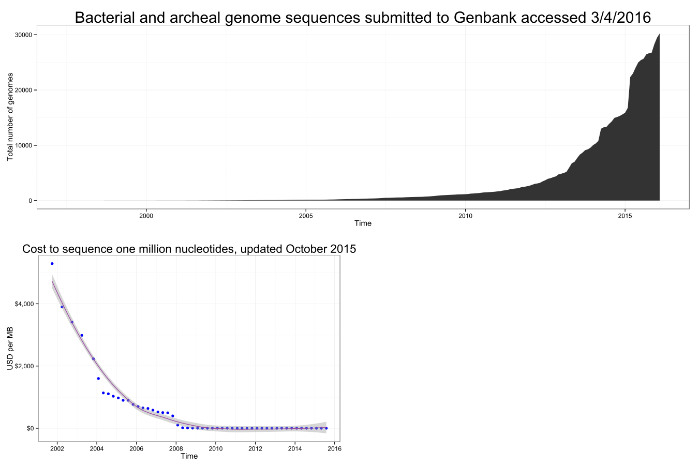

Intro to Microbial Communities
================
Kendra Maas
August 20, 2017

Why are we here?
================

-   Microbes control everything!^\*
-   We can! 

^\* Well almost, sort of

Community profile
=================

-   Conserved gene
    -   Balance homology and variability <!--  -->

Community profile
=================

-   Conserved gene
    -   Balance homology and variability
        <!--  -->

Cartoon of wet lab process
==========================

<!--  -->
Why are we here?
================

-   What to do with MB-GB of sequencing data?
    -   Great there are programs!
    -   Oh they're only command line
-   How to make sense of complex communities?
    -   Multivariate
    -   Non-linear
    -   Non-normal
    -   Independent variables?

Why are we here?
================

-   Command line
    -   Learning curve
    -   Customization
    -   Learning curve
-   **Reproducible Research**

Reproducible Research
=====================

-   Document process so it can be replicated
-   Enable collaborative analysis
-   Reduce time repeating analyses

Your most important collaborator is yourself 3 months ago and that collaborator doesn't answer emails.

Cautionary tale
===============

<!--  -->
Cautionary tale
===============

<!--  -->
Cautionary tale
===============

<!--  -->
mothur
======

Detailed, well documented guide for mothur
<http://www.mothur.org/wiki/MiSeq_SOP>

Download the RDP trainset and the Silva db

My scripts for working with sequence data
<https://github.com/krmaas/bioinformatics/>

Etherpad for this workshop <https://public.etherpad-mozilla.org/p/microbiome>

Basespace
=========

Download all samples in Workshop project

Seqs are barcode names, folder is client name
I have a one-liner to deal with that but first

bash terminal
=============

| Command     | Action                    |
|-------------|---------------------------|
| cd          | change directory          |
| mv          | move (mv -r move folder)  |
| ls (-lh)    | list files (list details) |
| less        | print to screen           |
| ctl-shift-c | copy                      |
| ctl-shift-v | paste                     |

bash tools
==========

| Tool | function         |
|------|------------------|
| sed  | find and replace |
| awk  | text manipulator |
| vim  | text editor      |

prep seqs for mothur
====================

Make files file

sample path/to/R1.fastq path/to/R2.fastq

make.file()

Reduce PCR and seqeuencing errors
=================================

<table style="width:36%;">
<colgroup>
<col width="12%" />
<col width="12%" />
<col width="11%" />
</colgroup>
<thead>
<tr class="header">
<th>Command</th>
<th>Purpose</th>
<th>Finer Points</th>
</tr>
</thead>
<tbody>
<tr class="odd">
<td>make.contigs()</td>
<td>Overlap forward and reverse read</td>
<td>Similar to Pandaseq, q score difference not cutoff</td>
</tr>
<tr class="even">
<td>summary.seqs()</td>
<td>Check length distribution</td>
<td></td>
</tr>
<tr class="odd">
<td>screen.seqs(maxambig, maxlength)</td>
<td>Remove ambiguous bases, too short/long seqs</td>
<td>We remove any seq with any N, length trim <em>could</em> have phylogenetic bias</td>
</tr>
</tbody>
</table>

Housekeeping
============

<table style="width:33%;">
<colgroup>
<col width="12%" />
<col width="12%" />
<col width="8%" />
</colgroup>
<thead>
<tr class="header">
<th>Command</th>
<th>Purpose</th>
<th>Finer Points</th>
</tr>
</thead>
<tbody>
<tr class="odd">
<td>unique.seqs()</td>
<td>Reduces computation cost</td>
<td>count replicats but remove from fasta</td>
</tr>
<tr class="even">
<td>count.seqs()</td>
<td>Reduces computation cost</td>
<td>replaces names and groups</td>
</tr>
<tr class="odd">
<td>summmary.seqs()</td>
<td></td>
<td></td>
</tr>
<tr class="even">
<td>pcr.seqs()</td>
<td>create database w/ just v4</td>
<td>only need to do once per target</td>
</tr>
<tr class="odd">
<td>system(mv)</td>
<td>call bash commands within mothur</td>
<td></td>
</tr>
<tr class="even">
<td>summary.seqs()</td>
<td>check seqs in silva alignment</td>
<td></td>
</tr>
</tbody>
</table>

Continue cleaning seqs
======================

<table style="width:33%;">
<colgroup>
<col width="12%" />
<col width="12%" />
<col width="8%" />
</colgroup>
<thead>
<tr class="header">
<th>Command</th>
<th>Purpose</th>
<th>Finer Points</th>
</tr>
</thead>
<tbody>
<tr class="odd">
<td>align.seqs()</td>
<td>Align to reference</td>
<td>Any alignment is acceptable</td>
</tr>
<tr class="even">
<td>summary.seqs()</td>
<td></td>
<td></td>
</tr>
<tr class="odd">
<td>screen.seqs(start, end, maxhomop)</td>
<td>remove seqs misaligned, homopolymers</td>
<td>Further cleaning PCR/sequencing errors using secondary structure</td>
</tr>
<tr class="even">
<td>filter.seqs(vertical)</td>
<td>remove columns that are all gaps</td>
<td>trump=T removes columns if any gap</td>
</tr>
<tr class="odd">
<td>summary.seqs()</td>
<td></td>
<td></td>
</tr>
</tbody>
</table>

Chimera checking
================

<table style="width:33%;">
<colgroup>
<col width="12%" />
<col width="12%" />
<col width="8%" />
</colgroup>
<thead>
<tr class="header">
<th>Command</th>
<th>Purpose</th>
<th>Finer Points</th>
</tr>
</thead>
<tbody>
<tr class="odd">
<td>pre.cluster(diffs)</td>
<td>cluster at 1% differences to reduce computation cost</td>
<td>greedy clustering, balance reducing data w/maintaining diversity</td>
</tr>
<tr class="even">
<td>summary.seqs()</td>
<td></td>
<td>Check change in unique sequences</td>
</tr>
<tr class="odd">
<td>chimera.uchime(dereplicate)</td>
<td>de novo find chimera within each sample</td>
<td>dereplicate, remove chimera from all samples?</td>
</tr>
<tr class="even">
<td>remove.seqs()</td>
<td></td>
<td>defaults remove all flagged seqs</td>
</tr>
<tr class="odd">
<td>summary.seqs()</td>
<td></td>
<td></td>
</tr>
</tbody>
</table>

OTU clustering
==============

<table style="width:33%;">
<colgroup>
<col width="12%" />
<col width="12%" />
<col width="8%" />
</colgroup>
<thead>
<tr class="header">
<th>Command</th>
<th>Purpose</th>
<th>Finer Points</th>
</tr>
</thead>
<tbody>
<tr class="odd">
<td>classify.seqs(reference, taxonomy)</td>
<td></td>
<td>default Wang/RDP</td>
</tr>
<tr class="even">
<td>remove.lineage(taxon)</td>
<td>remove wetlab bycatch</td>
<td>Chloroplast-Mitochondria-unknown-Archaea-Eukaryota</td>
</tr>
<tr class="odd">
<td>summary.tax()</td>
<td></td>
<td>file for Krona plots</td>
</tr>
<tr class="even">
<td>cluster.split(splitmethod, taxlevel, cutoff)</td>
<td>heuristic cluster within taxon</td>
<td>limiting by classification reduces computation without greedy</td>
</tr>
<tr class="odd">
<td>make.shared(label)</td>
<td>create OTU table</td>
<td>uneven seqs/sample</td>
</tr>
</tbody>
</table>

Alpha and Beta diversity
========================

<table style="width:33%;">
<colgroup>
<col width="12%" />
<col width="12%" />
<col width="8%" />
</colgroup>
<thead>
<tr class="header">
<th>Command</th>
<th>Purpose</th>
<th>Finer Points</th>
</tr>
</thead>
<tbody>
<tr class="odd">
<td>count.groups()</td>
<td></td>
<td>determine subsample level</td>
</tr>
<tr class="even">
<td>summary.single(calc, subsample)</td>
<td>alpha diversity</td>
<td></td>
</tr>
<tr class="odd">
<td>dist.shared(calc, subsample, iters)</td>
<td>beta diversity</td>
<td>reduce iters if in a hurry</td>
</tr>
<tr class="even">
<td>classify.otu()</td>
<td>attach names to OTUs</td>
<td>Doesn't impact clustering</td>
</tr>
<tr class="odd">
<td>get.oturep(method)</td>
<td>abudance or centroid</td>
<td></td>
</tr>
<tr class="even">
<td>sub.sample(shared, size)</td>
<td></td>
<td>For feature selection</td>
</tr>
</tbody>
</table>
