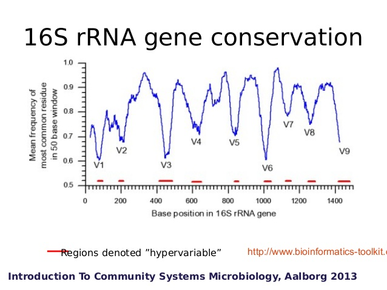
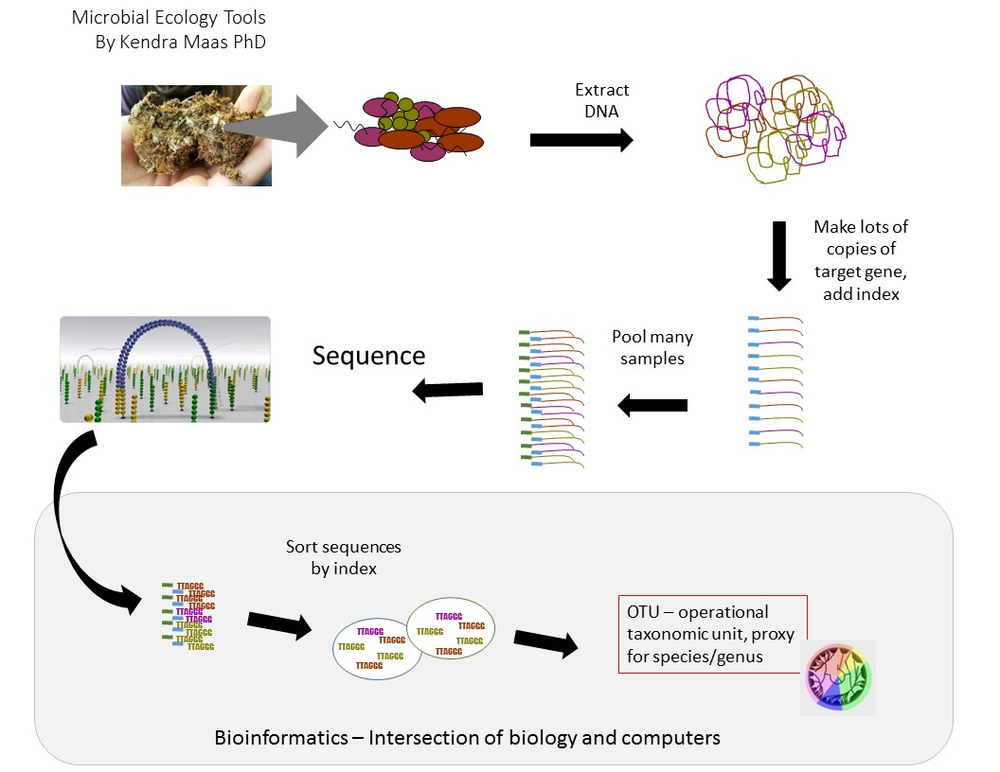
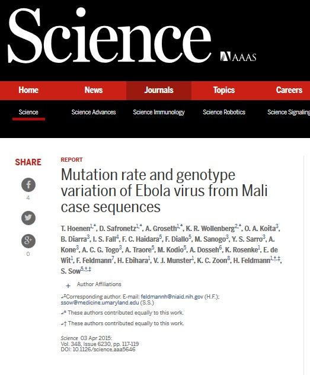
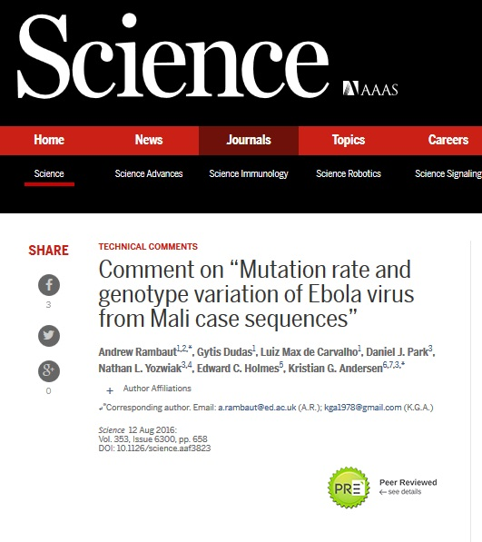
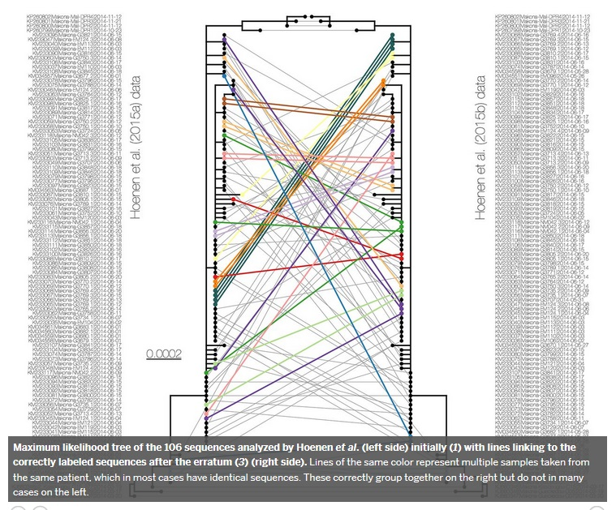

#Intro to Microbial Communities

## Why are we here?

 - Microbes control everything!^*
 - We can!

^* Well almost, sort of

## Community profile

    - Conserved gene 
    - Balance homology and variability 

## Community profile

- Conserved gene
    - Balance homology and variability  

## Cartoon of wet lab process

## Why are we here?

 - What to do with MB-GB of sequencing data?
    - Great there are programs!
    - Oh they're only command line
 - How to make sense of complex communities?
    - Multivariate
    - Non-linear
    - Non-normal
    - Independent variables?

## Why are we here?

- Command line
    - Learning curve
    - Customization
    - Learning curve

## **Reproducible Research**

- Document process so it can be replicated
- Enable collaborative analysis
- Reduce time repeating analyses

Your most important collaborator is yourself 3 months ago and that collaborator doesn't answer emails.

## Cautionary tale

## Cautionary tale

## Cautionary tale

## Tools
### mothur

Detailed, well documented guide for mothur  
<http://www.mothur.org/wiki/MiSeq_SOP>

Download the RDP trainset and the Silva db

My scripts for working with sequence data  
<https://github.com/krmaas/bioinformatics/>

Etherpad for this workshop
<https://public.etherpad-mozilla.org/p/microbiome>

### Basespace

Download all samples in Workshop project

Seqs are barcode names, folder is client name  
I have a one-liner to deal with that but first 

### bash terminal

Command | Action
--------|------
cd | change directory  
mv | move (mv -r move folder)  
ls (-lh) | list files (list details)  
less | print to screen  
ctl-shift-c | copy  
ctl-shift-v | paste

### bash tools

Tool | function
---|---
sed | find and replace
awk | text manipulator 
vim | text editor

